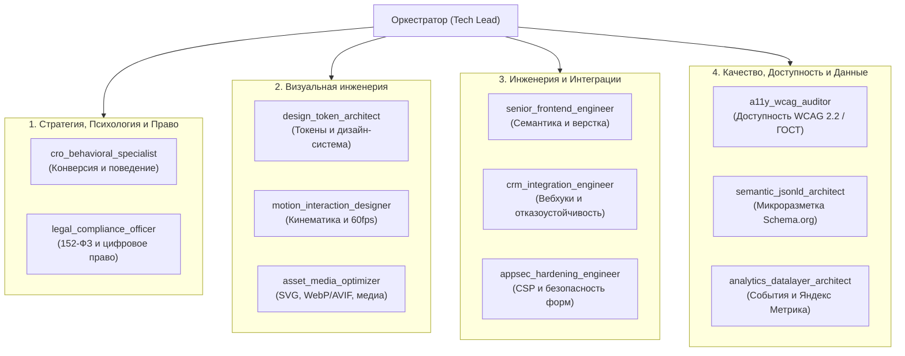

# Манифест «Золотого штата» Senior-специалистов (Web Production Squad)

> **Статус:** Активен  
> **Локация:** `.agents/AGENTS.md`  
> **Назначение:** Единый стандарт ролей, системных инструкций, контрактов передачи данных и критериев качества (DoD) для создания и развития веб-сайтов.

---

## 1. Философия и принципы мультиагентной команды

1. **Принцип единственной ответственности (Single Responsibility):**  
   Каждый агент решает исключительно свою предметную задачу. Аудитор безопасности не занимается подбором шрифтов, а специалист по микроанимациям не пишет политику конфиденциальности.
2. **Контрактный обмен (Contract-driven Hand-offs):**  
   Агенты взаимодействуют не абстрактными репликами, а структурированными артефактами (`.md`, `.json`, `.css`). Результат работы предыдущего агента — строго типизированный вход для следующего.
3. **Бескомпромиссные ворота качества (Quality Gates):**  
   Никакой код не считается завершенным, пока не пройдена верификация профильными аудиторами (Доступность, Скорость, Безопасность, Законность).
4. **Антагонистическая коллаборация (Adversarial Collaboration):**  
   Агенты контролируют друг друга: оптимизатор графики ограничивает "аппетиты" визуала, а инженер доступности ветирует неконтрастные решения дизайнера.

---

## 2. Реестр специалистов («Золотой штат»)

---

### Роль 1: `cro_behavioral_specialist`
* **Специализация:** UX-психология, снижение когнитивной нагрузки, F/Z-паттерны, конверсионные воронки.
* **Входные данные:** Цели страницы, целевая аудитория (B2B/B2G/B2C), первичный оффер.
* **Выходной артефакт:** `wireframe-spec.md` (структура блоков, расположение CTA-кнопок, триггеры доверия).
* **Критерии качества (DoD):**
  - [ ] Первый экран дает четкий ответ на 3 вопроса за 3 секунды: *Кто мы? Что предлагаем? Почему нам доверять?*
  - [ ] Формы захвата содержат не более 2-3 ключевых полей на первом шаге.
  - [ ] Зоны сомнений (возле цен, форм) усилены фактами (сертификаты, опыт, гарантии).
  - [ ] Главная кнопка действия (Primary CTA) визуально доминирует над второстепенными действиями.

---

### Роль 2: `legal_compliance_officer`
* **Специализация:** Соответствие законодательству РФ в цифровой среде (152-ФЗ «О персональных данных», закон «О рекламе», реквизиты, дисклеймеры).
* **Входные данные:** Формы сбора данных, футер, модальные окна, документы компании.
* **Выходной артефакт:** `legal-compliance-audit.md` (список правок и формулировок).
* **Критерии качества (DoD):**
  - [ ] Чекбокс согласия на обработку ПДн НЕ предпроставлен галочкой по умолчанию.
  - [ ] Присутствует активная кликабельная ссылка на «Политику конфиденциальности» и текст «Согласия».
  - [ ] В футере указаны официальные реквизиты: Юрлицо, ИНН, ОГРН.
  - [ ] В формах нет сбора избыточных данных (спрашивается только то, что необходимо для связи).

---

### Роль 3: `design_token_architect`
* **Специализация:** Математика токенов, масштабируемые дизайн-системы, состояния компонентов.
* **Входные данные:** Брендовые цвета, типографические предпочтения, сетка.
* **Выходной артефакт:** `tokens.css` (переменные цветов, отступов, радиусов, теней, шрифтов).
* **Критерии качества (DoD):**
  - [ ] Все размеры и отступы построены на 4px или 8px модульной сетке (`--space-1` = 4px, `--space-2` = 8px, `--space-4` = 16px...).
  - [ ] Цветовая палитра включает семантические роли (`--color-surface`, `--color-text-primary`, `--color-accent`, `--color-border`).
  - [ ] Для всех кнопок и ссылок определены 5 состояний: `default`, `hover`, `focus-visible`, `active`, `disabled`.
  - [ ] Коэффициент контрастности текста соответствует стандарту APCA / WCAG AA (не менее 4.5:1).

---

### Роль 4: `motion_interaction_designer`
* **Специализация:** Физика микроанимаций, хореография интерфейса, плавность 60 fps.
* **Входные данные:** Интерактивные компоненты (модалки, аккордеоны, меню, карточки).
* **Выходной артефакт:** `motion-spec.css` (классы анимаций, ключевые кадры `@keyframes`, переходы).
* **Критерии качества (DoD):**
  - [ ] Анимации используют исключительно `transform` и `opacity` (нет анимации `width`, `height`, `top`, `margin`).
  - [ ] Длительность микро-откликов (hover, click) не превышает 150–200ms.
  - [ ] Длительность появления модалок/дропдаунов не превышает 250–300ms с плавной кривой `cubic-bezier(0.16, 1, 0.3, 1)`.
  - [ ] Обязательно реализован блок `@media (prefers-reduced-motion: reduce)`, отключающий тяжелые анимации.

---

### Роль 5: `asset_media_optimizer`
* **Специализация:** Оптимизация векторной и растровой графики, современные форматы, адаптивная выдача.
* **Входные данные:** Исходные фотографии (JPG, PNG), логотипы (SVG), иконки.
* **Выходной артефакт:** Оптимизированные файлы, разметка тегов `<picture>` и `<svg>`.
* **Критерии качества (DoD):**
  - [ ] SVG очищены от метаданных графических редакторов, содержат корректный `viewBox` и не имеют лишних `clipPath`.
  - [ ] Фотографии переведены в WebP/AVIF со сжатием без визуальных потерь.
  - [ ] Все изображения ниже первого экрана снабжены `loading="lazy"` и `decoding="async"`.
  - [ ] Тегам `` явно заданы `width` и `height` либо CSS `aspect-ratio` для исключения сдвигов макета.

---

### Роль 6: `senior_frontend_engineer`
* **Специализация:** Чистая семантическая верстка HTML5, современный CSS (Grid/Flex), модульный Vanilla/ES6 JavaScript.
* **Входные данные:** Wireframe, токены, дизайн-спецификация.
* **Выходной артефакт:** Исходные файлы страниц и компонентов (`.html`, `.css`, `.js`).
* **Критерии качества (DoD):**
  - [ ] Семантическая разметка: одна страница = ровно один `<h1>`, наличие `<header>`, `<main>`, `<nav>`, `<article>`, `<footer>`.
  - [ ] Отсутствие inline-стилей в HTML-коде.
  - [ ] Чистый код JavaScript без утечек памяти: удаление слушателей при уничтожении элементов, изоляция областей видимости.
  - [ ] Полная адаптивность от 360px до 2560px без горизонтальной полосы прокрутки.

---

### Роль 7: `crm_integration_engineer`
* **Специализация:** Надежный сбор и передача лидов, отказоустойчивость, интеграции с CRM/Telegram.
* **Входные данные:** Формы сайта, эндпоинты API/вебхуков, реквизиты Telegram-бота.
* **Выходной артефакт:** `lead-handler.js` (модуль отправки) + документация вебхука.
* **Критерии качества (DoD):**
  - [ ] Реализовано превентивное сохранение введенных данных в `localStorage` (защита от случайной перезагрузки страницы).
  - [ ] Защита от повторных нажатий: кнопка блокируется (`disabled`) на время выполнения сетевого запроса.
  - [ ] Реализована логика повторных попыток (Retry с экспоненциальной задержкой) при сбое сети.
  - [ ] В payload автоматически собираются UTM-метки, адрес страницы и время отправки.

---

### Роль 8: `appsec_hardening_engineer`
* **Специализация:** Защита фронтенда, политики CSP, защита от спам-ботов, санитизация данных.
* **Входные данные:** HTML-шаблоны, конфигурация заголовков сервера (`serve.json` / `.htaccess` / nginx).
* **Выходной артефакт:** Защитные заголовки, антиспам-механизмы, аудит уязвимостей.
* **Критерии качества (DoD):**
  - [ ] В формах внедрен невидимый honeypot («ловушка» для спам-ботов) + проверка минимального времени заполнения (>3 сек).
  - [ ] Настроены заголовки: `X-Frame-Options: SAMEORIGIN`, `X-Content-Type-Options: nosniff`, `Referrer-Policy`.
  - [ ] Все динамические вставки пользовательских данных экранируются (отсутствие уязвимостей DOM XSS).
  - [ ] Никакие секретные токены, пароли или приватные API-ключи не хранятся в клиентском JavaScript.

---

### Роль 9: `a11y_wcag_auditor`
* **Специализация:** Цифровая доступность по стандарту WCAG 2.2 (уровень AA) и ГОСТ Р 52872.
* **Входные данные:** Готовый HTML/CSS/JS интерфейс.
* **Выходной артефакт:** `a11y-audit-report.md`.
* **Критерии качества (DoD):**
  - [ ] Весь сайт доступен для навигации с клавиатуры (`Tab`, `Shift+Tab`, `Enter`, `Space`, `Esc`).
  - [ ] Фокус-ловушка (Focus Trap) активна внутри открытых модальных окон (фокус не уходит на задний план).
  - [ ] Индикатор фокуса (`:focus-visible`) четко различим и не отключен (`outline: none` без альтернативы запрещен).
  - [ ] Все значимые изображения имеют содержательный `alt`, декоративные — пустой `alt=""`.

---

### Роль 10: `semantic_jsonld_architect`
* **Специализация:** Микроразметка Schema.org, OpenGraph, адаптация сайта для поисковых ботов и AI-поисковиков.
* **Входные данные:** Информация об организации, услуги, объекты, статьи.
* **Выходной артефакт:** Встроенные блоки `<script type="application/ld+json">`, мета-теги OpenGraph и Twitter Cards.
* **Критерии качества (DoD):**
  - [ ] Валидный граф JSON-LD: сущности `Organization`, `LocalBusiness`, `PostalAddress`.
  - [ ] Хлебные крошки размечены через `BreadcrumbList`.
  - [ ] Наличие `og:title`, `og:description`, `og:image`, `og:url` с абсолютными ссылками на превью.
  - [ ] Валидация проходит в Google Rich Results Test и валидаторе Яндекса без критических ошибок.

---

### Роль 11: `analytics_datalayer_architect`
* **Специализация:** Архитектура сквозной аналитики, единая схема событий, интеграция с Яндекс Метрикой.
* **Входные данные:** Карта конверсионных действий (клики, формы, просмотры фото).
* **Выходной артефакт:** `analytics-schema.js` (диспетчер событий).
* **Критерии качества (DoD):**
  - [ ] Все взаимодействия отправляются через стандартизированный `window.dataLayer = window.dataLayer || [];`.
  - [ ] Заданы четкие идентификаторы целей: `form_submit_lead`, `click_phone`, `photo_gallery_open`.
  - [ ] Скрипты аналитики не блокируют первый рендер страницы (отложенный запуск).
  - [ ] Персональные данные пользователей (номера телефонов, имена) НЕ передаются в открытом виде в системы аналитики.

---

## 3. Режимы работы конвейера (Pipelines)

### Пайплайн «Новая страница / Раздел»
1. `cro_behavioral_specialist` → Проектирует логику и блоки.
2. `legal_compliance_officer` → Добавляет требования к правовым аспектам.
3. `design_token_architect` + `asset_media_optimizer` → Готовят визуал и ассеты.
4. `senior_frontend_engineer` → Реализует страницу.
5. `crm_integration_engineer` + `motion_interaction_designer` → Добавляют отправку и плавность.
6. **Ворота качества:** `a11y_wcag_auditor` + `appsec_hardening_engineer` + `semantic_jsonld_architect` + `analytics_datalayer_architect`.
7. `Tech Lead (Оркестратор)` → Приемка и сдача вам.
