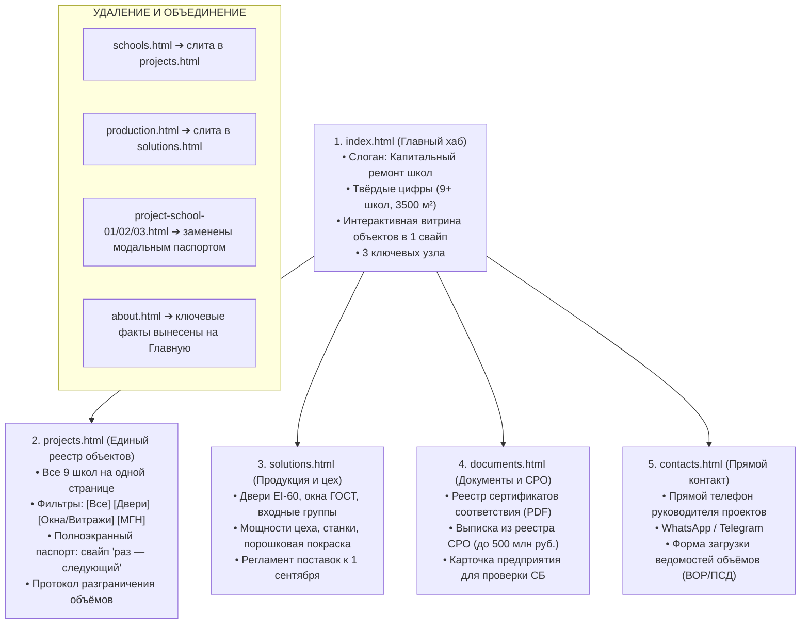

# План реструктуризации и модернизации сайта ООО «Константа»

Комплексный технический и смысловой план переработки веб-ресурса компании **ООО «Константа»** — производителя и монтажного подрядчика по капитальному ремонту школ Москвы и Московской области.

---

## 1. Контекст, аудит и ключевые проблемы

По результатам аудиозаписи переговоров с заказчиком и анализа существующего кода в папке `CONSTANTAv2/konstanta` выявлены критические проблемы текущей версии:

> **Юридический и репутационный риск (Недостоверный состав работ):**  
> В текущей версии ко всем объектам применён шаблонный копирайт («окна, двери, входные группы»). На реальном примере заказчика (**Школа им. Цветаевой**) компания делала **исключительно межкомнатные двери** (ПВХ, алюминиевые, противопожарные), но **не делала** окна и входную группу. Приписывание чужих объёмов работ грозит прямыми претензиями со стороны технадзора, генподрядчиков и контрольных органов.

> **Ощущение «сложно и перегружено» (UX / Информационная архитектура):**
> 1. **Дублирование разделов:** Пункты меню `Школы` (`schools.html`) и `Объекты` (`projects.html`) дублируют одну и ту же сущность. Пользователь путается и не понимает разницы.
> 2. **Тупиковые страницы (Dead Ends):** Страницы отдельных объектов (`project-school-01.html`, `02`, `03`) не имеют навигации «Вперёд / Назад». Посмотрев одну школу, посетитель вынужден возвращаться назад через меню.
> 3. **Отсутствие быстрого просмотра («раз — следующий»):** Заказчик прямо озвучил ключевой паттерн: *«смахивать: раз — следующий, раз — следующий, чтобы было доступно»*. В текущей версии 9 школ спрятаны в самом низу страницы `projects.html` в виде трёх крошечных картинок на карточку.
> 4. **Размытая терминология:** Слово *«Переоборудование»* режет слух производственникам и ассоциируется с закупкой станков/парт. Реальная сфера — **«Капитальный ремонт школ»**.
> 5. **«Маркетинговая вода» и пустые заглушки:** Страница `production.html` фактически пуста, а каталог изделий на `solutions.html` не содержит нужных генподрядчику характеристик (ГОСТ, пределы огнестойкости EI-60, антипаника).

---

## 2. Итоговая архитектура сайта (5 ключевых страниц)

Сокращаем раздутую структуру с 10 разрозненных файлов до **5 самодостаточных страниц**.

---

## 3. Подробный посекционный план каждой страницы

### СТРАНИЦА 1. ГЛАВНАЯ (`index.html`) — 5 экранов вместо 12
Цель: 5-секундная верификация компании генеральным подрядчиком или заказчиком.

#### Секция 1: Hero (Ударный первый экран)
* **Уровень 1 (Eyebrow):** `КАПИТАЛЬНЫЙ РЕМОНТ ШКОЛ` (16px, Bold, `#FFFFFF`, uppercase).
* **Уровень 2 (Hero H1):** **Капитальный ремонт. В деталях.** (72–96px, Semibold, `#F5F5F7`, отрицательный трекинг `-0.03em`, line-height `1.05`).
* **Уровень 3 (Subheadline / Body):** Производство и монтаж **дверных блоков**, **оконных систем** и **противопожарных преград** для образовательных учреждений Москвы и Московской области.
* **CTA-кнопки:** `[Смотреть объекты ↗]` (акцентная) и `[Рассчитать смету]` (контурная).
* **Фоновое изображение:** Контрастная панорама сданного школьного объекта с фирменным знаком качества.

#### Секция 2: Твёрдые факты (Metrics Bar)
4 монолитные колонки с конкретными показателями:
1. **`9+`** — **школ сдано** точно к 1 сентября.
2. **`3 500 м²`** — **мощность цеха** светопрозрачных конструкций в месяц.
3. **`EI-60`** — **предел огнестойкости** сертифицированных противопожарных дверей.
4. **`100%`** — **соблюдение графика** в условиях сжатых сроков летних каникул.

#### Секция 3: Интерактивная витрина «Объекты в 1 свайп»
*(Реализация ключевого пожелания заказчика)*
* **Формат:** Широкоформатный карточный слайдер с кнопками навигации $\leftarrow$ и $\rightarrow$, поддержкой тач-свайпа на мобильных устройствах.
* **Элементы слайда:**
  * Фотография главного фасада / портала школы.
  * Название и округ (например: *Школа на Батайском проезде · ЮВАО*).
  * **Spotlight-теги состава работ:** `[✓ Противопожарные двери]` `[✓ Алюминиевые витражи]` `[✓ Окна классов]`.
  * Быстрое переключение: *раз — следующий, раз — следующий*.
* **Кнопка перехода:** `[Смотреть весь реестр объектов (9) ↗]`.

#### Секция 4: Специализация (3 строительных направления)
Сетка из 3 блоков со строгими техническими параметрами:
1. **Дверные преграды:** Огнестойкие глухие и остеклённые двери EI-60, системы «Антипаника», износостойкие двери ПВХ для санузлов и столовых.
2. **Оконные и витражные блоки:** Профили ГОСТ, детские замки безопасности, ударопрочные стеклопакеты триплекс, фасадные алюминиевые группы.
3. **Безопасная среда и МГН:** Пандусы, двойные поручни из нержавеющей стали AISI 304, беспороговые проёмы.

#### Секция 5: Экспресс-заявка / Расчёт по ВОР (Fast CTA)
* **Заголовок:** **Есть ведомость проёмов? Рассчитаем за 24 часа.**
* Поле быстрой отправки файла (PDF / Excel / чертёж) или прямой переход в Telegram / WhatsApp к инженеру.

---

### СТРАНИЦА 2. РЕЕСТР ОБЪЕКТОВ (`projects.html`) — 4 секции
Цель: Полная прозрачность выполненных работ, отсутствие тупиков и юридическая безопасность.

#### Секция 1: Hero Реестра
* **Eyebrow:** `ПОДТВЕРЖДЁННЫЙ ОПЫТ`
* **H1:** **Реализованные объекты.**
* **Описание:** 9 объектов капитального ремонта в Москве и области с детализацией по выполненным конструкциям.

#### Секция 2: Фильтры работ (Filter Bar в 1 клик)
Интерактивные кнопки фильтрации:
`[Все объекты (9)]` · `[Только двери]` · `[Окна и витражи]` · `[Входные группы и МГН]`

#### Секция 3: Интерактивный каталог + Полноэкранный Паспорт («Раз — следующий»)
* **Карточки объектов в сетке:** Каждая школа оформлена как визитка (главное фото, адрес, бейджи *только реально выполненных* работ, кнопка `[Паспорт объекта ↗]`).
* **Полноэкранный Паспорт (Modal Overlay):**
  * Открывается без перезагрузки страницы.
  * **Навигация:** Кнопки $\leftarrow$ Пред. и След. $\rightarrow$, клавиши стрелок клавиатуры, мобильный свайп.
  * **Фотогалерея:** Крупные фотографии именно тех узлов, которые смонтированы.
  * **Протокол разграничения объёмов (Audit Shield):**
    * *Кейс Школы им. Цветаевой:*
      * **Выполненные работы:** **Межкомнатные двери ПВХ**, **Алюминиевые двери**, **Противопожарные двери EI-60**.
      * **Примечание:** Окна и входная группа на данном объекте выполнялись сторонними подрядчиками.

#### Секция 4: Тендерный CTA
* «Требуется подтверждение объёмов для ПТО? Предоставим акты КС-2 и сертификаты по любому сданному объекту».

---

### СТРАНИЦА 3. ПРОДУКЦИЯ И ЦЕХ (`solutions.html`) — 4 секции
Цель: Доказать инженерному составу генподрядчика наличие собственного мощного производства.

#### Секция 1: Hero
* **Eyebrow:** `СОБСТВЕННОЕ ПРОИЗВОДСТВО`
* **H1:** **Цех. Монтаж. Контроль.**
* **Описание:** Выпуск до **3 500 м²** светопрозрачных конструкций и до **450 дверных блоков** в месяц.

#### Секция 2: Каталог конструктивных решений
1. **Дверные системы:**
   * Противопожарные EI-60 глухие и с остеклением до 25% (ГОСТ Р 57327-2016).
   * Влагостойкие двери для пищеблоков и санузлов.
   * Усиленная фурнитура «Антипаника» (ГОСТ Р 52750-2007).
2. **Оконные и витражные блоки:**
   * Тёплый и холодный алюминий, ПВХ-системы 70–82 мм.
   * Детские замки безопасности (ГОСТ 23166-2021).
   * Закалённое стекло и триплекс в зонах детской активности.
3. **Входные тамбуры и МГН:**
   * Беспороговые притворы, автоматические доводчики, пандусы по СП 59.13330.

#### Секция 3: Производственные мощности и регламент «1 Сентября»
* **Станки:** ЧПУ-центры резки и сварки, автоматические зачистные станки.
* **Покраска:** Собственная камера порошковой окраски (любой цвет по каталогу RAL).
* **Специфика школьного капремонта:** Ночная доставка, разгрузка по графику, работа параллельных монтажных бригад.

#### Секция 4: CTA
* [Запросить технический каталог и прайс-лист для проектировщиков ↗].

---

### СТРАНИЦА 4. ДОКУМЕНТЫ И СРО (`documents.html`) — 3 секции
Цель: Быстрое прохождение комплаенса и проверки службой безопасности.

#### Секция 1: Hero
* **Eyebrow:** `ТЕНДЕРНЫЙ АРХИВ`
* **H1:** **Допуски. Сертификаты.**
* **Описание:** Полный пакет разрешительной документации для заключения договоров по 44-ФЗ и 223-ФЗ.

#### Секция 2: Реестр сертификатов (Скачивание в 1 клик)
Табличный список документов со статусами и кнопками скачивания:
1. **Выписка из реестра членов СРО** (строительство, реконструкция, капремонт).
2. **Сертификаты соответствия ФЗ № 123** (двери противопожарные металлические и остеклённые EI-60).
3. **Сертификаты ГОСТ 23166-2021** (блоки оконные).
4. **Экспертные санитарно-эпидемиологические заключения** для детских учреждений.

#### Секция 3: Карточка контрагента (Для договоров и проверки СБ)
* Реквизиты ООО «Константа» (ИНН, ОГРН, КПП, банковские реквизиты) + кнопки `[Скопировать реквизиты]` и `[Скачать карточку предприятия PDF]`.

---

### СТРАНИЦА 5. КОНТАКТЫ (`contacts.html`) — 3 секции
Цель: Мгновенная передача проектно-сметной документации (ПСД) без лишних барьеров.

#### Секция 1: Прямые контакты без посредников
* Телефон прямого руководителя проектов капитального ремонта: `+7 915 015-66-05`.
* Прямые кнопки мессенджеров: **WhatsApp** и **Telegram**.
* Адрес производства и офиса в Москве.

#### Секция 2: Форма передачи ведомости проёмов
* Поля: Имя, Телефон/Email, Название школы/объекта.
* **Зона прикрепления файлов (Drag-and-Drop):** «Прикрепите ведомость объёмов (ВОР), спецификацию проёмов или чертежи — подготовим расчёт за 24 часа».

#### Секция 3: Логистическая зона
* Карта с зоной обслуживания: Москва (все округа) и Московская область.

---

## 4. Дизайн-система: Светлый корпоративный стиль (mos.ru / Департамент образования)

В соответствии с требованиями заказчика интерфейс строится в оригинальном светлом корпоративном стиле образовательных и строительных порталов Москвы:

1. **Цветовая матрица:**
   * Фон страницы: спокойный светлый контейнер (`#e6e9ed`), карточки и рабочие области — чистый белый (`#ffffff`) и мягкий серый (`#f3f5f7`, `#f8fafc`).
   * Карточки и подложки: белый фон с деликатными контурами (`#dfe3e7`, `#ebedf0`) и лёгкими тенями (`rgba(31, 54, 70, 0.08)`).
   * Заголовки и ключевой текст: глубокий графитовый (`#171717`).
   * Второстепенный и поясняющий текст: нейтральный серый (`#5b6269`).
   * Фирменные акценты: московский синий (`#4a9bd0`, тёмно-синий `#2583bf`, светлый фон бейджей `#dceef8`, акцентные кнопки `#177dbb` с hover `#096da9`).
   * Внимание / Маркировка: нормативный красный (`#d61f3c`) для противопожарной защиты EI-60.
2. **Типографика (Golos Text):**
   * Официальный шрифт муниципальных порталов Москвы: `'Golos Text', -apple-system, BlinkMacSystemFont, Arial, sans-serif`.
   * Заголовки Hero: 48–64px (на мобильных 32–40px), Semibold / Bold, контрастный графитовый или белый на фирменной синей плашке.
   * Подзаголовки секций: 24–32px, чёткая иерархия без лишней декоративности.
   * Основной текст: 16–18px, line-height 1.5, читаемый и комфортный для быстрого восприятия ПТО и генподрядчиками.
3. **Визуальная ясность (Снять ощущение «сложно»):**
   * Вместо перегруженных таблиц — лаконичные карточки с контрастными бейджами состава работ.
   * Полноэкранный паспорт объекта с крупными фото и навигацией «раз — следующий».
   * Юридическая защита (Audit Shield) в виде заметного информационного блока с разграничением зон ответственности.
4. **Копирайтинг:**
   * Строгий производственно-инженерный язык: «Капитальный ремонт школ», «Дверные блоки EI-60», «Оконные конструкции ГОСТ», «Пандусы МГН».
   * Исключение маркетинговой «воды» в пользу твёрдых фактов, сроков (к 1 сентября) и сертификатов.

---

## 5. Технический план выполнения

1. **Файл данных `site-data.js`:**
   * Добавить поле `actualWorks` и `disclaimers` по каждой из 9 школ.
   * Настроить данные объекта по ул. Цветаевой (строго двери, без окон/входа).
   * Подготовить категории для фильтрации (`doors`, `windows`, `mgn`).
2. **Логика `site-pages.js` и `script.js`:**
   * Реализовать слайдер объектов на главной странице с кнопками $\leftarrow \rightarrow$ и тач-событиями.
   * Реализовать модальный паспорт объекта на странице `projects.html` с бесшовным переключением («раз — следующий»).
   * Настроить фильтрацию карточек по видам работ.
3. **Стили `styles.css`:**
   * Реализовать светлый корпоративный стиль mos.ru (чистый белый и серый фон, московский синий, Golos Text, контрастные бейджи работ, стили слайдера и модального паспорта).
4. **Обновление вёрстки:**
   * Переработать `index.html`, `projects.html`, `solutions.html`, `documents.html`, `contacts.html`.
   * Удалить или перенаправить устаревшие файлы `schools.html`, `production.html`, `project-school-01/02/03.html`, `about.html`.
5. **Верификация:**
   * Проверить работу локального сервера на `http://localhost:4173`.
   * Протестировать свайп объектов и фильтры на мобильных и десктопных разрешениях.
